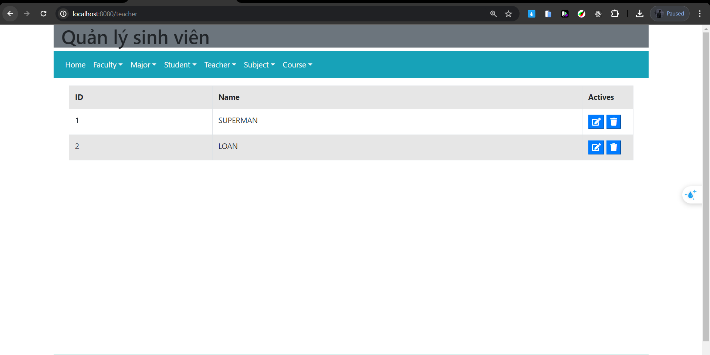
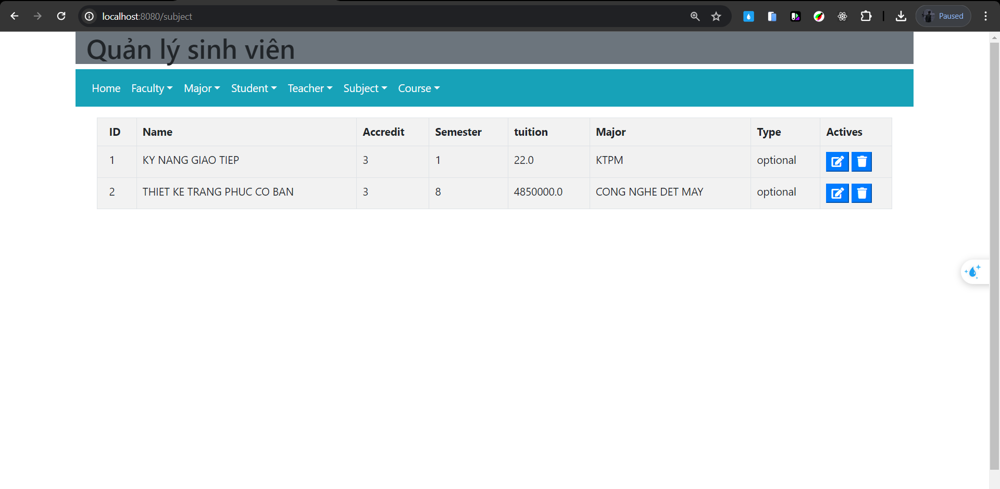
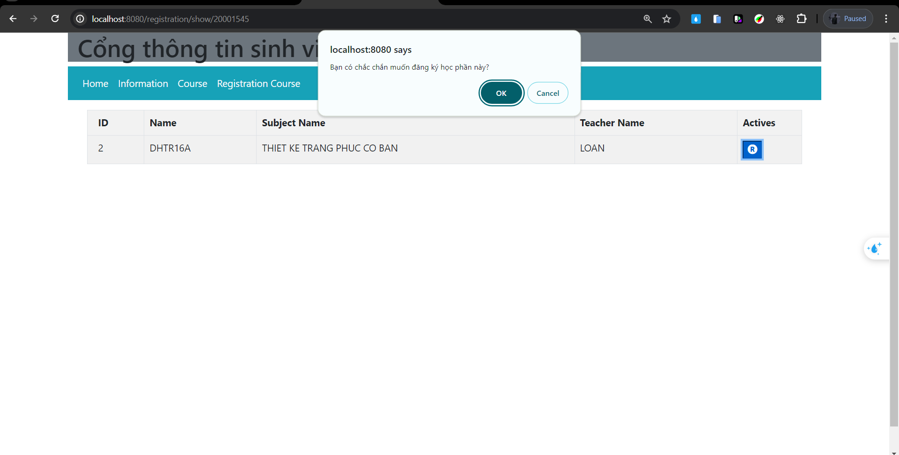

# KTTKPM_Nhom36 Kiến trúc MVC
## Database

## Class diagram :

## MVC Architecture :

## Cấu trúc source

## Quản lý học phần

## Sinh Viên đăng ký học phần

## Hạn chế 
- Chưa thể login
- Chưa phòng ngừa trường hợp sinh viên đăng ký xong rồi hủy bỏ, nhà trường yêu cầu sinh viên phải xác nhận trước khi đăng ký
- Chưa Sau khi đăng ký thành công, một email thông báo sẽ được gửi cho sinh viên xác nhận việc đăng ký và nhận quyết định đóng học phí
- hệ thống không có khả năng cho phép sinh viên xem thông tin học tập của mình (số tín chỉ đã đạt, số môn đã học, điểm môn học, điểm trung bình tích lũy…), thời khóa biểu theo tuần và các tiện ích khác.
- Chưa có sau khi số tín chỉ đã đạt theo từng ngành, sinh viên có quyền đăng ký xét tốt nghiệp. Nếu mọi tiêu chuẩn đều thỏa mãn, sinh viên sẽ được cấp bằng tốt nghiệp và sẽ được đưa vào danh sách các cựu sinh viên. Thông tin về bằng cấp sẽ được công khai trên trang web của nhà trường. Thông tin của cựu sinh viên sẽ được lưu giữ để theo dõi quá trình làm việc (nếu sinh viên đồng ý), làm các cuộc survey, cũng như nhiều hoạt động khác.
## Thiết kế chính sử dụng kiến trúc MVC
